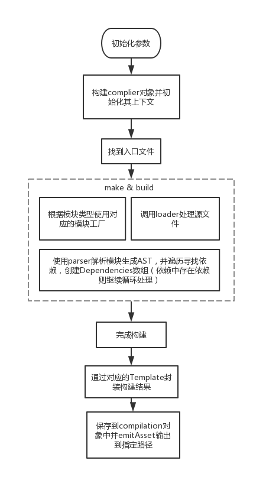
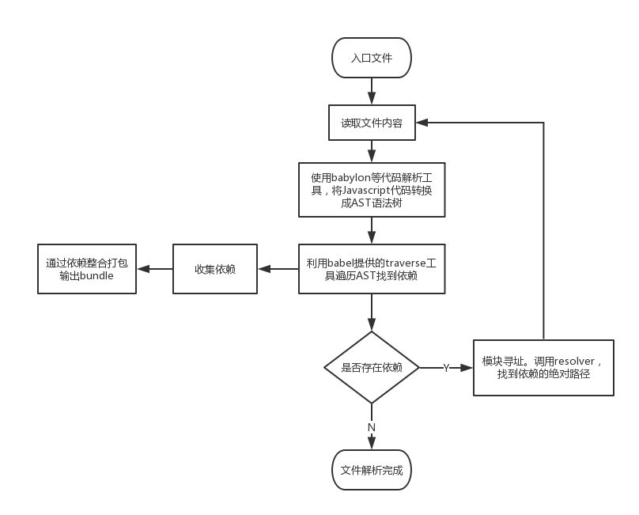

# webpack-group

介绍webpack相关的原理和知识

## 讲解目录

- 关于webpack的基本概念
- 如何实现一个基本的打包
- 简要分析webpack构建流程
- Loader的基本概念与应用
- 入门编写一个自定义Loader
- 使用Loader串联
- 关于Loader优化
- 插件的应用场景和使用机制

## 我们要讲什么？怎么讲？

## wepback流程

## wepback基本打包原理

## 参考文档

- [AST Explorer](https://astexplorer.net)
- [Babel REPL](https://babeljs.io/repl)
- [Babylon](https://github.com/babel/babel/tree/master/packages/babel-parser)
- [Babel Plugin Handbook](https://github.com/thejameskyle/babel-handbook/blob/master/translations/en/plugin-handbook.md)
- [Webpack: Modules](https://webpack.js.org/concepts/modules)
- [Babylon和babel-traverse详解](https://github.com/xtx1130/blog/issues/7)
- [HMR原理](https://zhuanlan.zhihu.com/p/30669007)
- [命令行输入webpack的时候发生了什么](https://github.com/DDFE/DDFE-blog/issues/12)
- [webpack plugin内部运行机制](https://zhuanlan.zhihu.com/p/26555032)
- [《细说webpack之流程篇》](http://taobaofed.org/blog/2016/09/09/webpack-flow/)
- [浅析 Webpack 插件化设计](https://zhuanlan.zhihu.com/p/26955349)
- [babel转换ES6 module的原理](https://ryerh.com/javascript/2016/03/27/babel-module-implementation.html)
- [webpack模块化原理Commonjs](https://segmentfault.com/a/1190000010349749)
- [webpack模块化原理ESmodule](https://segmentfault.com/a/1190000010955254)
- [webpack es6、commonjs模块混合打包分析](https://juejin.im/post/5a5cca556fb9a01cad7c283c)
- [撸一个webpack loader](https://juejin.im/post/5a698a316fb9a01c9f5b9ca0)
- [搜罗一切webpack的好文章好工具](https://github.com/webpack-china/awesome-webpack-cn)