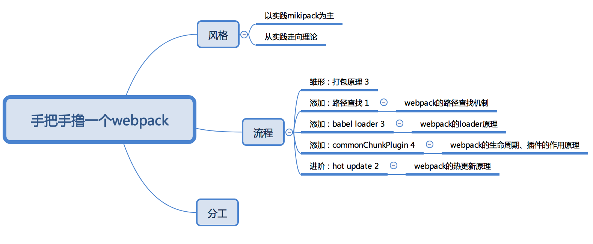

# webpack-group

> 一生万物，而万物归一

介绍webpack相关的原理和知识

## Webpack原理分析

- 常见loader的原理分析
- plugins的应用场景和使用机制
- resolve如何实现解析
- devServer原理是什么
- 如何进行Webpack的性能优化
- Webpack4升级了什么点

## 我们要讲什么？怎么讲？

## 参考文档

- [AST Explorer](https://astexplorer.net)
- [Babel REPL](https://babeljs.io/repl)
- [Babylon](https://github.com/babel/babel/tree/master/packages/babel-parser)
- [Babel Plugin Handbook](https://github.com/thejameskyle/babel-handbook/blob/master/translations/en/plugin-handbook.md)
- [Webpack: Modules](https://webpack.js.org/concepts/modules)